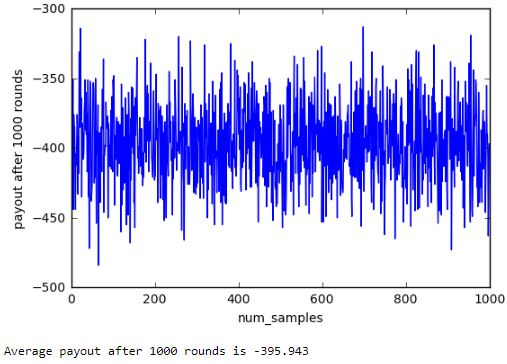
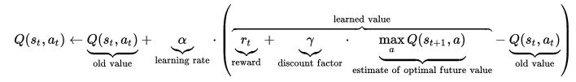
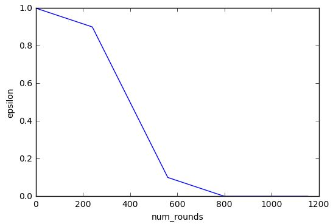
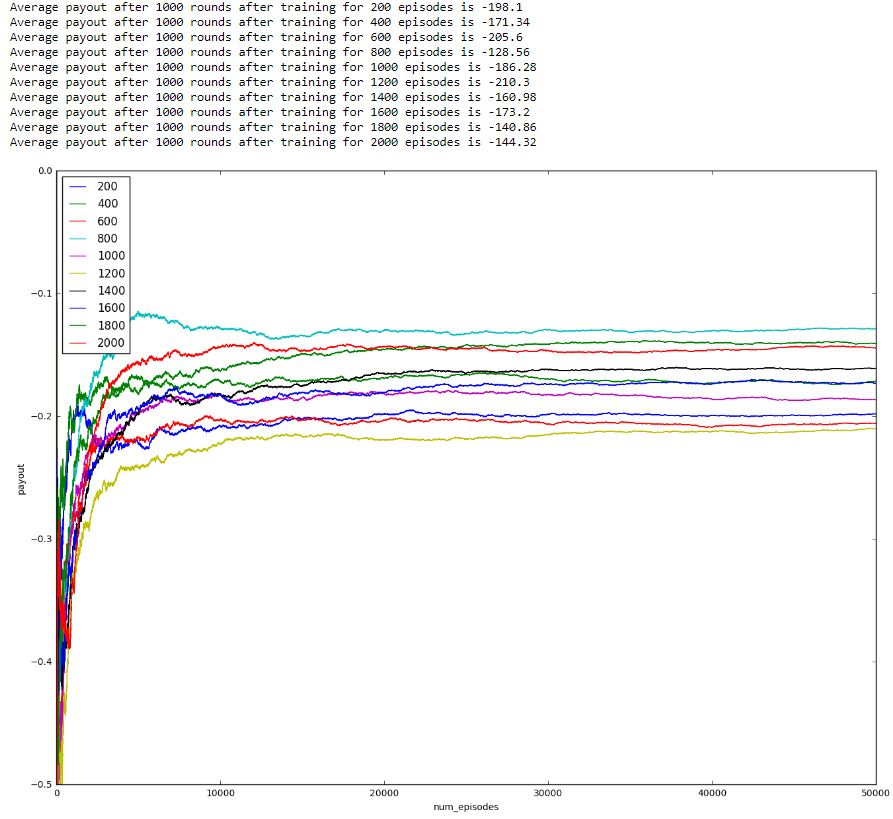
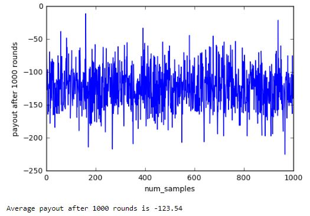

# Machine Learning Engineer Nanodegree
## Capstone Project
Pradhyo Bijja           
August 4th, 2017

## I. Definition

### Project Overview

This project will attempt to teach a computer (reinforcement learning agent) how to play blackjack and beat the average casino player. Blackjack [1] also known as twenty-one, is the most widely played casino banking game in the world. It is a comparing card game between a player and dealer, meaning players compete against the dealer but not against other players. Mathematicians have been researching Blackjack for over 60 years [2] because of its simple rules, its inherent random nature, and the abundance of “prior” information available to an observant player [3]. 

### Problem Statement

The aim of this project is to produce a Blackjack strategy that will earn more than the average casino player. 

##### Blackjack Rules for this project
Blackjack is a card game where the goal is to obtain cards that sum to as near as possible to 21 without going over. They're playing against a fixed dealer.           
Here are the rules of the game:           

Face cards (Jack, Queen, King) have point value 10. Aces can either count as 11 or 1, and it's called 'usable' at 11. This game is placed with an infinite deck (or with replacement). The game starts with each (player and dealer) having one face up and one face down card.            

The player can request additional cards until they decide to stop or exceed 21 (bust). After the player sticks, the dealer reveals their facedown card, and draws until their sum is 17 or greater. If the dealer goes bust, the player wins. If neither player nor dealer busts, the outcome (win, lose, draw) is decided by whose sum is closer to 21.             

The reward for winning is +1, drawing is 0, and losing is -1.

##### Strategy
A reinforcement learning technique, Q-learning, will be used to solve this problem. A Q-table is built for all state-action pairs and after taking an action at the end of each round of the game, its corresponding entry in the Q-table is updated based on the reward received. The learning process stops when epsilon decays to a value less than or equal to a tolerance value. At this point, we would have the optimized Q-table which is the strategy the agent has learned to play blackjack.

### Metrics

As there is a payout awarded at the end of each round of the game, it is the obvious choice as a performance metric. To compare the performance of different strategies, these strategies should be applied over a large number of rounds to get close to their true payouts. Hence, the average payout after 1000 rounds of the game repeated 100 times will be used to compare the simulated performance of the average casino player and that of the trained agent.

## II. Analysis

### Data Exploration

This project will make use of [Open AI Gym's](https://gym.openai.com/) [Blackjack environment](https://gym.openai.com/envs/Blackjack-v0).      

The actions and corresponding payouts of the average casino player are simulated using the Open AI blackjack environment mentioned above. Each round, either hit or stick is chosen at random. Over 1000 rounds, the average payout was found to be around -400 as seen below.       

### Algorithms and Techniques

Decaying epsilon-greedy Q-learning will be used to solve this problem as the number of states is reasonably small.           
- Possible values of sum of agent's cards [2, 21] = 20
- Face up card of dealer [1, 10] = 10
- Player has usable card [0, 1] = 2           

Size of the state space is 400. 

The agent maintains a Q-table which contains an entry for each state and the corresponding Q values for each action possible. When in a particular state of the environment, the agent looks up the maximum Q value for that state and takes the corresponding action. If a state is being reached for the first time, the Q value for each action of that state is initialized to 0 and the action in this case is random as all Q values for the new state are 0. The Q values are then updated based on the reward obtained from the environment using the below formula [4].

##### Learning rate (alpha)
The agent has to learn based on the reward for a particular action and the learning rate determines how much the agent learns. As can be seen above formula, *alpha*=0 will make the agent not learn anything while *alpha*=1 will make the agent consider only the most recent information.

##### Discount factor (gamma)
The discount factor *gamma* determines the importance of future rewards. A factor of 0 will make the agent "myopic" (or short-sighted) by only considering current rewards, while a factor approaching 1 will make it strive for a long-term high reward.

##### Exploration factor (epsilon)
To ensure the agent learns enough about the environment, it has to explore the environment enough. *epsilon* determines how much the agent explores by forcing the agent to take a random action with probability *epsilon*. This ensures the agent reaches new states it hasn't learned to reach before. However, as the agent learns enough about the environment it has to minimize exploring and thus a decaying value of *epsilon* is used. Its value should remain high enough for a while so the agent can sufficiently explore the environment before reducing slowly to a *tolerance* value. Once epsilon reaches this tolerance value, the exploration stops and the learning is also stopped by making *alpha* 0.

#### Number of episodes to train
This is a parameter I added to easily tweak the rate of decay of *epsilon* depending on the number of episodes used to teach the agent. *epsilon* drops to 90% of its initial value in the first 30% of `num_episodes_to_train`. *epsilon* then drops to 10% of its initial value in the next 40% of `num_episodes_to_train`. *epsilon* finally becomes 0 in the final 30% of `num_episodes_to_train`. Here 0 is the tolerance value at which we stop the learning process of the agent by setting *alpha* to 0. *epsilon* value decays like in the below graph when the `num_episodes_to_train=800`.

### Benchmark

Assuming the average player uses no strategy and makes a random choice each time (most likely while drunk), the payout at the end of 1000 rounds is simulated in the Open AI environment. This would be the benchmark against which the trained agent in this project will be compared. This exact scenario was simulated above and the benchmark value was found to be -398.38.

## III. Methodology

### Data Preprocessing

As the Open AI blackjack environment already provided data in a format suitable to be used with the Q-learning algorithm discussed above, no data preprocessing is necessary.

### Implementation

The algorithm described above in the **Algorithms and Techniques** section is implemented using Python. The code for this is provided in the accompanying [jupyter notebook](https://github.com/Pradhyo/blackjack/blob/master/blackjack.ipynb).       

The Agent can be created by passing the environment and the parameters discussed above. It has a `update_parameters()` function which updates *epsilon* and *alpha* at the end of each action. There is a `choose_action()` function that determines which action to take based on the *epsilon* and the values in the Q-table. This action results in a payout from the environment passed on to the agent's `learn()` function which updates the Q values in the table.

### Refinement

Only one custom parameter (`num_episodes_to_train`) was tweaked and suitable choices were made for the others. Initial value of *epsilon* was chosen to be its maximum value of 1. *alpha* was chosen to a common value of 0.5 and the discount factor *gamma* was chosen to be 0.2 to keep the agent short-sighted as most of the rounds finish in one, two or three states. The optimum value for `num_episodes_to_train` was searched over a list of values and chosen to be 800 based on below image. 

## IV. Results
_(approx. 2-3 pages)_

### Model Evaluation and Validation

The agent is created using the parameters chosen above and the simulations are run 1000 times - each time for 1000 rounds of the game. The agent learns for the first 800 rounds and makes it decisions during the remaining simulations based on its final Q-table.                  

Obtaining an average payout per 1000 rounds of around -125 over a large number of simulations proves the robustness of the model as such a large sample tests the model thoroughly. However, the payout over 1000 rounds of the game is likely to vary between -100 and -150 due to the inherent randomness of the game as seen below.

### Justification

Over 1000 rounds, the average payout was found to be much higher than the benchmark -400 with a value of around -125. This is a significant increase in the payout and proves that the agent has learned to satisfactorily play the game much better than the average casino player.         

## V. Conclusion

### Free-Form Visualization
In this section, you will need to provide some form of visualization that emphasizes an important quality about the project. It is much more free-form, but should reasonably support a significant result or characteristic about the problem that you want to discuss. Questions to ask yourself when writing this section:
- _Have you visualized a relevant or important quality about the problem, dataset, input data, or results?_
- _Is the visualization thoroughly analyzed and discussed?_
- _If a plot is provided, are the axes, title, and datum clearly defined?_

### Reflection
In this section, you will summarize the entire end-to-end problem solution and discuss one or two particular aspects of the project you found interesting or difficult. You are expected to reflect on the project as a whole to show that you have a firm understanding of the entire process employed in your work. Questions to ask yourself when writing this section:
- _Have you thoroughly summarized the entire process you used for this project?_
- _Were there any interesting aspects of the project?_
- _Were there any difficult aspects of the project?_
- _Does the final model and solution fit your expectations for the problem, and should it be used in a general setting to solve these types of problems?_

### Improvement
In this section, you will need to provide discussion as to how one aspect of the implementation you designed could be improved. As an example, consider ways your implementation can be made more general, and what would need to be modified. You do not need to make this improvement, but the potential solutions resulting from these changes are considered and compared/contrasted to your current solution. Questions to ask yourself when writing this section:
- _Are there further improvements that could be made on the algorithms or techniques you used in this project?_
- _Were there algorithms or techniques you researched that you did not know how to implement, but would consider using if you knew how?_
- _If you used your final solution as the new benchmark, do you think an even better solution exists?_

-----------

**Before submitting, ask yourself. . .**

- Does the project report you’ve written follow a well-organized structure similar to that of the project template?
- Is each section (particularly **Analysis** and **Methodology**) written in a clear, concise and specific fashion? Are there any ambiguous terms or phrases that need clarification?
- Would the intended audience of your project be able to understand your analysis, methods, and results?
- Have you properly proof-read your project report to assure there are minimal grammatical and spelling mistakes?
- Are all the resources used for this project correctly cited and referenced?
- Is the code that implements your solution easily readable and properly commented?
- Does the code execute without error and produce results similar to those reported?

### References

[1] [Wikipedia entry for Blackjack](https://en.wikipedia.org/wiki/Blackjack)          
[2] [The Optimum Strategy in Blackjack](http://blackjack-square.com/site/files/Baldwin_OptimalStrategyBlackjack.35.pdf)           
[3] [A Markov Chain Analysis Of Blackjack Strategy](http://inside.mines.edu/fs_home/mwakin/papers/mcbj.pdf)       
[4] [Q learning formulat](https://en.wikipedia.org/wiki/Q-learning#Algorithm)         

